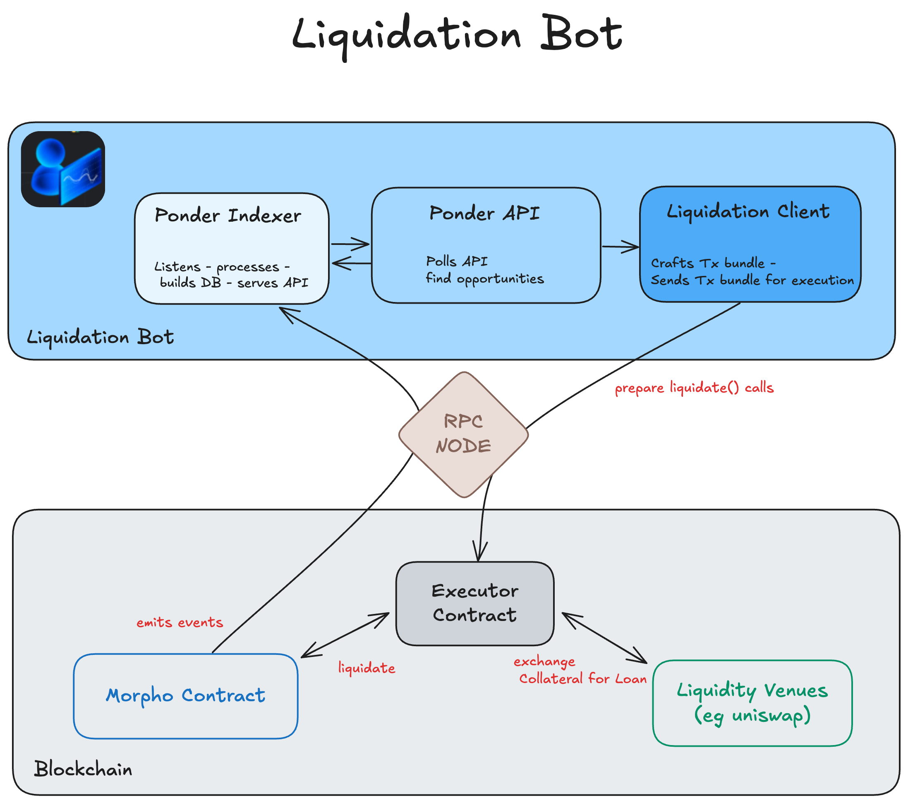
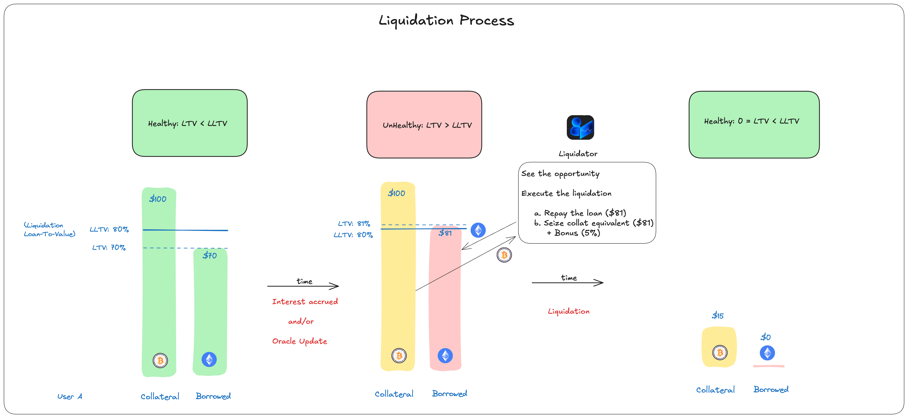

# Morpho Blue Liquidation Bot

A simple, fast, and easily deployable liquidation bot for the **Morpho Blue** protocol. This bot is entirely based on **RPC calls** and is designed to be **easy to configure**, **customizable**, and **ready to deploy** on any EVM-compatible chain.

## Visual Architecture



## Features

- Automatically detects liquidatable positions and executes the liquidations.
- Multi-chain compatible.
- Configurable liquidity venues.
- Minimal setup and dependencies (RPC-only, no extra infra required).

### ⚠️ Disclaimer

This bot is provided as-is, without any warranty. The **Morpho Association is not responsible** for any potential loss of funds resulting from the use of this bot, including (but not limited to) gas fees, failed transactions, or liquidations on malicious or misconfigured markets (although the market whitelisting mechanism is designed to protect against unsafe liquidations).

Use at your own risk.

## Requirements

- Node.js >= 20
- [pnpm](https://pnpm.io/) (this repo uses `pnpm` as package manager)
- [Docker](https://www.docker.com/) (optional, only needed if you want to run the database locally)
- A valid RPC URL (via Alchemy, Infura, etc)
- The private key of an EOA with enough funds to pay for gas.
- An executor contract deployed for this EOA (see [Executor Contract Deployment](#executor-contract-deployment)).

## Installation

```bash
git clone https://github.com/morpho-blue-liquidation-bot-org/morpho-blue-liquidation-bot.git
cd morpho-blue-liquidation-bot
pnpm install
```

## Chain Configuration

The bot can be configured to run on any EVM-compatible chain where the Morpho stack has been deployed. The chain configuration is done in the `apps/config/config.ts` file.
For each chain, here are the parameters that needs to be configured:

### Morpho Stack parameters (addresses and start blocks)

**If you don't plan on supporting a new chain, you can ignore this section.**

Morpho Blue:

- `morpho.address`: The address of the Morpho contract.
- `morpho.startBlock`: The block number of the Morpho contract deployment.

Adaptive Curve IRM:

- `adaptiveCurveIrm.address`: The address of the Adaptive Curve IRM contract.
- `adaptiveCurveIrm.startBlock`: The block number of the Adaptive Curve IRM contract deployment.

Meta Morpho Factories:

- `metaMorphoFactories.addresses`: The addresses of the MetaMorpho factories.
- `metaMorphoFactories.startBlock`: The block number of the oldest MetaMorpho factory deployment.

### Secrets

**Database secrets (optional):**

-`POSTGRES_DATABASE_URL`: The url of the postgres database that will be used by the bot. If not set, the bot will launch a docker container with a local postgres database.

**Chain secrets:**

For each chain, the following secrets must be set:

- `RPC_URL`: The RPC URL of the chain that will be used by the bot.
- `LIQUIDATION_PRIVATE_KEY`: The private key of the EOA that will be used to execute the liquidations.
- `EXECUTOR_ADDRESS`: The address of the executor contract. The bot uses an executor contract to execute liquidations. (see [Executor Contract Deployment](#executor-contract-deployment)).

**Markets Whitelist**: The bot will only liquidate positions from the markets that are whitelisted. There are two ways to whitelist markets:

- `VAULT_WHITELIST`: List of MetaMorpho vaults addresses. All the markets listed by those vaults will be whitelisted.
- `ADDITIONAL_MARKETS_WHITELIST`: List of markets ids. All these markets will be whitelisted (even if they are not listed by any vault).

The secrets must be set in the `.env` file at the root of the repository (e.g. `.env.example`), with the following keys:

- `RPC_URL_<chainId>`
- `EXECUTOR_ADDRESS_<chainId>`
- `LIQUIDATION_PRIVATE_KEY_<chainId>`
- `VAULT_WHITELIST_<chainId>`
- `ADDITIONAL_MARKETS_WHITELIST_<chainId>`

Example for mainnet (chainId 1):

```
RPC_URL_1=https://eth-mainnet.g.alchemy.com/v2/<your-alchemy-api-key>
EXECUTOR_ADDRESS_1=0x1234567890123456789012345678901234567890
LIQUIDATION_PRIVATE_KEY_1=0x1234567890123456789012345678901234567890123456789012345678901234
VAULT_WHITELIST_1=0xbeeF010f9cb27031ad51e3333f9aF9C6B1228183,0x8eB67A509616cd6A7c1B3c8C21D48FF57df3d458
ADDITIONAL_MARKETS_WHITELIST_1=0x1eda1b67414336cab3914316cb58339ddaef9e43f939af1fed162a989c98bc20
```

### Liquidity Venues Configuration

Liquidity venues are explained [below](#liquidity-venues).

Some liquidity venues require chain-specific configuration. This is done in the `apps/config/src/liquidityVenues/` folder.

For example, the `uniswapV3` venue has different factory addresses for some chains (although most of the time the factory is the default one). If you want to support a chain where the default address is not working, you have to set the correct factory address in the `specificFactoryAddresses` mapping in `apps/config/src/liquidityVenues/uniswapV3.ts`.

## Executor Contract Deployment

The bot uses an executor contract to execute liquidations ([executor repository](https://github.com/Rubilmax/executooor)).
These contracts are gated (they can only be called by the owner of the contract), so you need to deploy your own.

To do so, you just need to set the `rpcUrl` and `liquidationPrivateKey` in the `.env` for every chain you want to run the bot on (after configuring them in `apps/config/config.ts`), and run the following command:

```bash
pnpm deploy:executor
```

This will deploy your own executor contract on every chain you configured, and will log the addresses in the console.

You can also deploy your executor contract through [this interface](https://rubilmax.github.io/executooor/).

## Liquidity Venues

A liquidity venue is a way to exchange a token against another token. Within a liquidation, the bot will use liquidity venues in order to get the market's loan token in exchange of the collateral token.

The bot is designed to be configurable and support multiple liquidity venues.

For now, we implemented the following ones:

- ERC20Wrapper: Enables the withdrawal from ERC20Wrapper tokens.
- ERC4626: Enables the withdrawals from ERC4626 vaults.
- UniswapV3: Enables the swap of tokens on Uniswap V3.

Liquidity venues can be combined to create more complex strategies. For example, you can combine the `ERC4626` and `UniswapV3` venues to liquidate a position from a 4626 vault by first withdrawing from the vault and then swapping the underlying token for the desired token.

## Add your own venue

**If you don't plan on supporting a new liquidity venue, you can ignore this section.**

To add your own venue, you need to create a new folder in the `apps/client/src/liquidityVenues` folder.
This folder should contain up to 2 files:

- `index.ts`: In this file you will implement the new liquidity venue class that needs to implements the `LiquidityVenue` interface (located in `apps/client/src/liquidityVenues/liquidityVenue.ts`).
  This class will contain the logic of the venue, and needs to export two methods: `supportsRoute`(Returns true if the venue if pair of tokens `src` and `dst` is supported by the venue) and `convert`(Encodes the calls to the related contracts and pushes them to the encoder, and returns the new `src`, `dst`, and `srcAmount`). Both these methods can be async (to allow onchain calls).
- `abi.ts` (optional): Should contain all the ABIs of the contracts involved in the venue (if any).

### Configuration

If your venue requires chain-specific configuration, you need to add create a new file in the `apps/config/src/liquidityVenues` folder, named like the venue (e.g. `uniswapV3.ts`).

However, some venues don't need any configuration (ex: erc4626).

## Order the liquidity venues

The liquidity venues must be imported into the `apps/client/src/index.ts` file and pushed into the `liquidityVenues` array.
Be careful with the order of the array, as it will be the order in which the venues will be used by the bot.

## Run the bot

Once the bot is installed and configured, you can run it by executing the following command:

```bash
pnpm liquidate
```

This command will start the bot, which will start liquidating once the configured chains are fully indexed.

⚠⏱️ The indexing process can take some time depending on the chains numbers of blocks.

## Liquidation Process



## Config Changes

Unfortunately, Ponder doesn't allow the same schema to be used with different configs.
In this project, the config changes only if you add, remove, or modify a chain.

So, if you try to run the bot with a set of chains that's different from the one used in your initial run, indexing will fail.
There are two ways to handle this:

### Reset the postgres database

This is the easiest and most direct solution, but you will lose the indexed data for the previous chains.

If you're using Docker to run the local Postgres database, you can simply stop and remove the container and its volume:

```bash
docker compose down -v
```

### Use a new database

This way you can have different containers storing different indexing data for different sets of chains.

- If you're using Docker to run the local Postgres database, just change the port both in the postgres url given to ponder (line 93 in `apps/ponder/ponder.config.ts`, the current port being `5432`) and in `docker-compose.yml` (make sure to set the same port, and to remember the port used by each config).
- If you are using an external postgres database, you just need to change the `POSTGRES_DATABASE_URL`.
